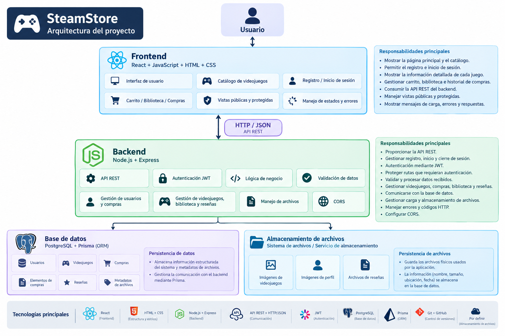

# Arquitectura del proyecto

## Arquitectura general

Gamix utilizará una arquitectura desacoplada entre el frontend y el backend. El frontend será responsable de la interfaz y la interacción con el usuario, mientras que el backend gestionará la lógica de negocio, la API REST, la autenticación y la comunicación con los sistemas de persistencia.

La comunicación entre el frontend y el backend se realizará mediante solicitudes HTTP utilizando datos en formato JSON.

### Estructura general

## Frontend

El frontend será desarrollado utilizando React, JavaScript, HTML y CSS. Se encargará de proporcionar la interfaz gráfica y permitir la interacción del usuario con el sistema.

Entre sus principales responsabilidades estarán:

* Mostrar la página principal y el catálogo de videojuegos.
* Permitir el registro e inicio de sesión.
* Mostrar la información detallada de cada videojuego.
* Gestionar las vistas del carrito, biblioteca e historial de compras.
* Consumir la API REST del backend.
* Manejar las vistas públicas y protegidas de la aplicación.
* Mostrar mensajes de carga, errores y respuestas del sistema.

## Backend

El backend será desarrollado con Node.js y Express. Será responsable de procesar las solicitudes realizadas desde el frontend y aplicar la lógica de negocio del sistema.

Entre sus principales responsabilidades estarán:

* Proporcionar la API REST.
* Gestionar el registro, inicio y cierre de sesión.
* Gestionar la autenticación mediante JWT.
* Proteger las rutas que requieran un usuario autenticado.
* Validar y procesar los datos recibidos.
* Gestionar las operaciones relacionadas con videojuegos, compras, biblioteca y reseñas.
* Comunicarse con la base de datos.
* Gestionar la carga y almacenamiento de archivos.
* Manejar errores y códigos de estado HTTP.
* Configurar la comunicación entre frontend y backend mediante CORS.

## Autenticación

La autenticación se realizará mediante JWT (JSON Web Tokens). Después de iniciar sesión correctamente, el backend generará un token que permitirá identificar al usuario en las solicitudes posteriores.

Las rutas que requieran autenticación estarán protegidas y verificarán la validez del token antes de permitir el acceso.

## Base de datos

La base de datos será PostgreSQL y se utilizará Prisma como ORM para facilitar la comunicación entre el backend y la base de datos.

La base de datos almacenará información estructurada del sistema, como:

* Usuarios.
* Videojuegos.
* Compras.
* Elementos de las compras.
* Reseñas.
* Metadatos relacionados con los archivos.

## Almacenamiento de archivos

El sistema contará con almacenamiento para los archivos utilizados por la aplicación, como imágenes de videojuegos, imágenes de perfil y archivos asociados a las reseñas.

Los archivos se almacenarán físicamente en el sistema de archivos o en un servicio de almacenamiento, mientras que la información relacionada con estos archivos, como nombre, tamaño, ubicación y fecha de creación, será almacenada en la base de datos.

## Comunicación entre componentes

El frontend y el backend se comunicarán mediante una API REST utilizando el protocolo HTTP y datos en formato JSON.

La API utilizará los principales métodos HTTP:

* **GET:** consultar información.
* **POST:** crear información.
* **PUT:** actualizar información.
* **DELETE:** eliminar información.

El backend responderá utilizando códigos de estado HTTP apropiados para indicar el resultado de cada solicitud.

## Persistencia de datos

Gamix utilizará dos mecanismos de persistencia:

1. **Base de datos:** almacenará la información estructurada y los metadatos de los archivos.
2. **Almacenamiento de archivos:** almacenará los archivos físicos utilizados por la aplicación.

De esta manera, la información de los archivos y los archivos mismos estarán relacionados sin almacenar directamente los archivos dentro de la base de datos.

## Tecnologías principales

- **Frontend:** React + JavaScript.
- **Estructura y estilos:** HTML + CSS.
- **Backend:** Node.js + Express.
- **Comunicación:** API REST + HTTP/JSON.
- **Autenticación:** JWT.
- **Base de datos:** PostgreSQL.
- **ORM:** Prisma.
- **Control de versiones:** Git + GitHub.
- **Almacenamiento de archivos:** Por definir.
